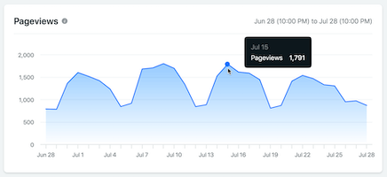
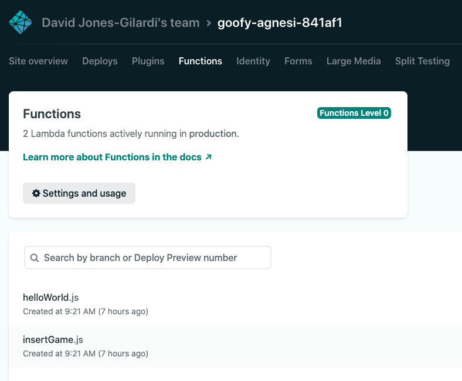

# 📚 What can Netlify do for you

🏠 [Table of Contents](./README.md#%EF%B8%8F-table-of-contents) > 📚 **Step1 - [ What can Netlify do for you](#README_Netlify.md)**

If you are already familiar with **Netlify Serverless functions** and just want to move on to the next exercise go to section =>  ⚒️ [Expose your "hello world" API ](./README_step01.md). Otherwise, read on.

**We will cover:**
1. [Build, Package, deploy, host](#1-build-package-deploy-host)
2. [Advanced features](#2-advanced-features)
3. [Netlify Functions](#3-netlify-functions)
4. [Netlify Functions](#4-want-to-learn-more-)

---
## 1. Build, Package, deploy, host

We already introduced you the features to Build, Package, deploy and  host before to deploy your empty application. Here the schema:

- **✅ Configure builds** – Netlify can run your build command and deploy the result whenever you push to your Git repo. Get started with basic build settings, learn about managing build dependencies, and explore additional options available with file-based configuration.

- **✅ Site deploys** – Atomic deploys with Netlify guarantee that your site is always consistent. Learn how to manage deploys, enable deploy notifications, and run a branch-based split test.

## 2. Advanced features

You have already seen a first feature of Netlify by creating and deploying a site. This part is called [The workflow](https://www.netlify.com/products/workflow/).

To know more about the **sites** here are the [documentation](https://docs.netlify.com/site-deploys/overview/#deploy-summary).
- **⚙️ [Monitor sites](https://docs.netlify.com/monitor-sites/analytics/#get-started)** – Learn how Netlify Analytics lets you monitor trends in site activity. Monitor builds to understand the role individual sites play in your team's builds usage. Explore what kinds of logs and notifications are available for your sites.

- **⚙️ Domains & HTTP** Register a new domain in the Netlify UI, or use a domain you already own, to assign a custom domain to your site. Either way, you can have Netlify handle DNS management for you. We provide free automatic HTTPS on all sites.

- **⚙️ Forms:** You can use Netlify Forms without adding API calls or extra JavaScript on your site, configure extra spam prevention beyond our automatic spam filtering, and receive notifications about new submissions.

- **⚙️ CLI** You can use Netlify's command line interface to deploy sites or configure continuous deployment. Netlify Dev brings the functionality of your Netlify production environment directly to your local machine.

- **⚙️ API** To get started with the Netlify API, learn how to authenticate and make a request. Then explore options for deploying via API and usage for some popular endpoints.

## 3. Netlify Functions

> *Source [Netlify Documentation](https://docs.netlify.com/functions/overview/#manage-your-serverless-functions)*

Netlify lets you deploy serverless Lambda functions without an AWS account, and with function management handled directly within Netlify. Your serverless functions are version-controlled, built, and deployed along with the rest of your Netlify site, and we will automatically handle service discovery through our built-in API gateway. This eliminates overhead and brings the power of Deploy Previews and rollbacks to your serverless functions.

**Why this is cool ?**

What this translates to is an ability to create serverless functions in your application that can be accessed seamlessly in your local environment or via a global CDN _(once deployed)_ without the need for an actual server to deploy code to. Just configure the `netlify.toml`, create the function, and move on.

**How does this work in our application ?**

In **BattleStax**, we configure `netlify.toml` **functions** to use the `functions` folder within our application.

From there, just drop any functions you intend to be **serverless** into the `functions` folder and export a handler.

That's it. Once a function is implemented in this fashion it will be deployed as a **serverless** function both locally and via a global CDN once pushed to Netlify.

Ok, let's do this ourselves in the next exercise.

## 4. Want to learn more ?

- 📄  This [document](https://docs.netlify.com/functions/configure-and-deploy/#configure-the-functions-folder) goes into details about implementing **serverless** functions with Netlify and this [tutorial](https://kentcdodds.com/blog/super-simple-start-to-netlify-functions) spells it out. 

---
🏠 **Back** to [Table of Contents](./README.md#%EF%B8%8F-table-of-contents) or **move** to the next section **=>**  ⚒️ [Expose your "hello world" API ](./README_step01.md)